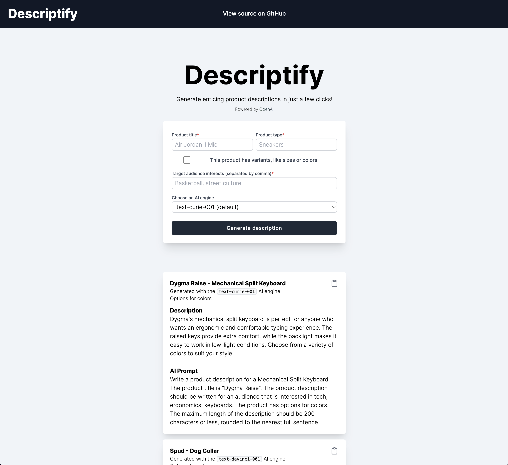

# ✏️ Descriptify
A simple product description generator, powered by [OpenAI](https://openai.com/api/).

## 📖 Table of Contents
- [Tech stack](https://github.com/sandypockets/descriptify#-tech-stack)
- [Getting started](https://github.com/sandypockets/descriptify#-getting-started)
  - [Dependencies](https://github.com/sandypockets/descriptify#-dependencies)
  - [Dev dependencies](https://github.com/sandypockets/descriptify#dev-dependencies)
- [Testing](https://github.com/sandypockets/descriptify#-testing)
- [Screenshots](https://github.com/sandypockets/descriptify#-screenshots)

## 🚀 Tech stack
- [React.js](https://reactjs.org/)
- [Next.js](https://nextjs.org/)
- [Tailwind CSS](https://tailwindcss.com/)
- [Supabase](https://supabase.com/)

## 🛠 Getting started
Descriptify was developed and tested with Node.js `17.8.0`.

1. Clone the repository:

```bash
git clone https://github.com/sandypockets/descriptify.git
```

2. Change into the project directory:
```shell
cd descriptify
```

3. Copy the contents of the `.env.example` file to `.env`:
```shell
cp .env.example .env
```

4. Set up Supabase:
   1. Visit [Supabase](https://supabase.com/) and create an account and new database.
   2. In Supabase, go to **Settings > API** and copy your `anon public` key and `url` to the `.env` file.
   3. Go to the SQL Editor tab on the left, and click **+ New query**. 
   4. Paste the following query into the editor and run it:
   
```sql
create table product_descriptions (
    id bigint generated by default as identity primary key,
    created_at timestamp with time zone default now(),
    title varchar not null,
    type varchar not null,
    has_variants boolean not null,
    options text not null,
    target_audience text not null,
    ai_engine varchar not null,
    ai_prompt text not null,
    ai_response text not null
);
```

5. Set up OpenAI:
   1. Go to [OpenAI](https://beta.openai.com/signup) and create an account.
   2. Go to [this page](https://beta.openai.com/account/api-keys) to get your API key, and organization ID. Paste them into the `.env` file.
6. Install dependencies:
```shell
yarn install
```

### 📦 Dependencies

- @supabase/supabase-js `^1.35.3`
- cors `^2.8.5`
- next `12.1.6`
- openai `^2.0.5`
- react `18.1.0`
- react-dom `18.1.0`

#### Dev dependencies

- autoprefixer `^10.4.7`
- cypress `^9.6.1`
- eslint `8.15.0`
- eslint `fig-next": "12.1.6`
- postcss `^8.4.13`
- prettier `2.6.2`
- tailwindcss `^3.0.24`

## 🧪 Testing
Descriptify is tested with [Cypress](https://www.cypress.io/).

1. If the development server isn't already running, start it:
```shell
yarn dev
```

2. Open Cypress UI, and start the test runner. 
```shell
yarn test
```

## 📸 Screenshots
